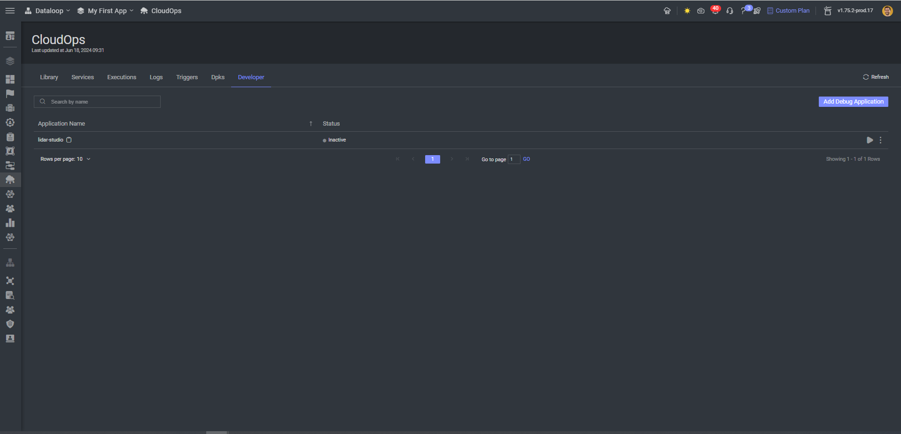
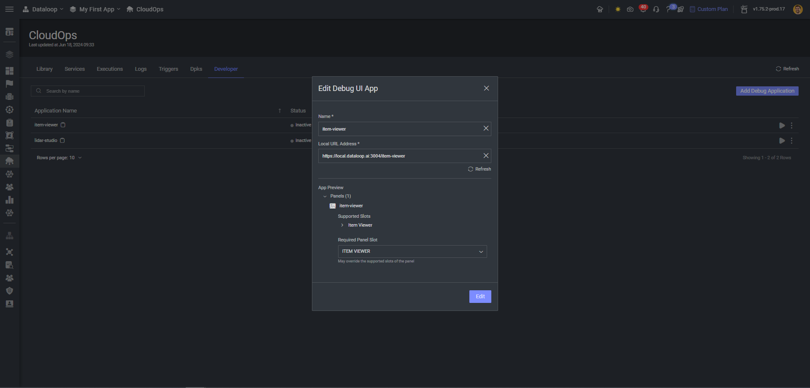
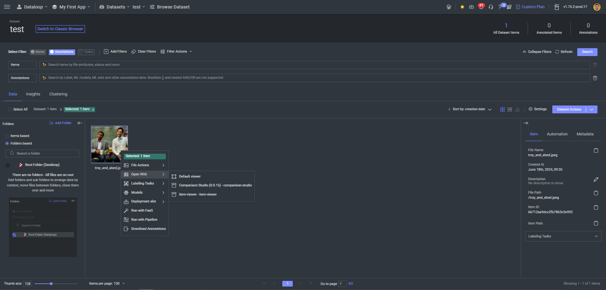
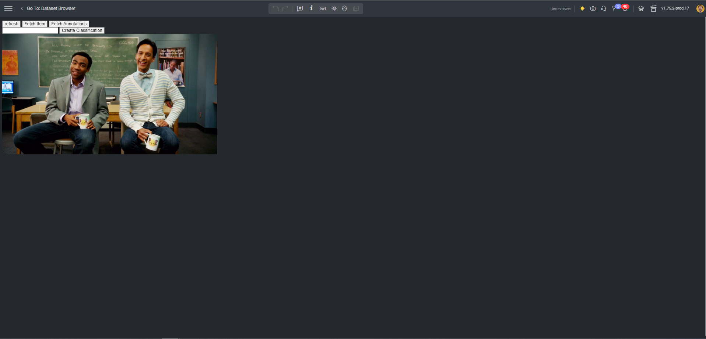

<p align="left">
  
</p>

# Simple Item Viewer


## Description

This application contains a simple item viewer that displays image files and its classifications.

The application allows also the creation and deletion of classifications on the specific image item.

## Setup

### Prerequisites

For this app development you'll need:

- Working python env (preferably 3.10), install the Dataloop SDK: `pip install dtlpy --upgrade`
- Docker installed and working
- Dataloop account

### Clone

Clone the repository and navigate to the directory

```shell
git clone https://github.com/dataloop-ai-apps/item-viewer  
cd item-viewer
```

### Deployment

Create a project and publish the app

```python
import dtlpy as dl

project = dl.projects.get('My First App')
dpk = project.dpks.publish()
```

### Installation

Installing in a project:

```python
app = project.apps.install(dpk=dpk)
```

Or update the existing app:

```python
app = project.apps.get(app_name=dpk.display_name)
app.dpk_version = dpk.version
app.update()
```

### Local Development

You can set up a local development mode using docker, and work on the app directly on the platform.

#### Serve locally

We'll use a docker image to serve the app. Using ngnix we'll serve the static files on the app route.

1. For working on a dev/local environment, you will need to add local.dataloop.ai to your hosts file.
   Open your hosts file with admin/sudo privileges.
   This is normally in `/etc/hosts` on Linux, `C:\Windows\System32\drivers\etc\hosts` on Windows.
   Add the following lines to the end of the file:

```text
# dataloop local
127.0.0.1 local.dataloop.ai
```

2. Next, we'll build the docker and start it

```shell
docker build -t local-app:0.0.1 -f ./Dockerfile . 
docker run -p 3000:3000  -it -v E:\Applications\item-viewer:/tmp/app local-app:0.0.1 bash
```

Inside the docker, we'll start the servers
```shell
./start_dev.sh
```

Now the app is running locally. you can navigate to the local url

```shell
https://local.dataloop.ai:3000/item-viewer/
```

#### Add the local app to the platform

1. Navigate to the platform, to the CloudOps page
   
2. Add a new dev application
   
3. Go to any item in the project, and open the `Open With` menu:
   
4. Click on the app to open the viewer
   

All Set! Now you can work locally and develop the app easily.

## Next

For more examples check out apps on our [GitHub space](https://github.com/dataloop-ai-apps).
More applications docs [here](https://developers.dataloop.ai/tutorials/applications/introduction/chapter/)
and some more manifests examples [here](https://developers.dataloop.ai/tutorials/applications/dpk_examples/chapter/)

## Contributions, Bugs and Issues - How to Contribute

We welcome anyone to help us improve this app.  
[Here's](CONTRIBUTING.md) a detailed instructions to help you open a bug or ask for a feature request
